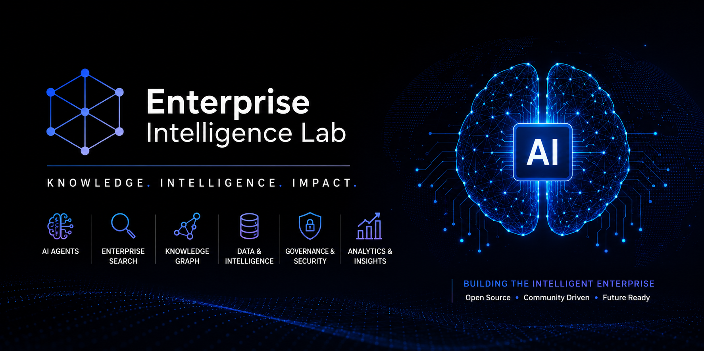

<p align="center">

</p>

# 🧠 Enterprise Digital Brain
<p align="center">


</p>

---

## 🚀 Overview

Enterprise Digital Brain is an open-source framework for building intelligent enterprise knowledge platforms powered by Artificial Intelligence, Large Language Models, Agentic AI, Retrieval-Augmented Generation (RAG), and Knowledge Graphs.

The goal is to enable organizations to transform enterprise knowledge into an intelligent decision-support system.

---

## 🎯 Vision

Create an AI-powered digital brain capable of:

- Enterprise Search
- Intelligent Knowledge Discovery
- AI Assistants
- Agentic Workflows
- Decision Intelligence
- Enterprise Memory
- Knowledge Graphs
- AI Governance

---

# 🏗 Architecture

```
Enterprise Applications
            │
            ▼
Enterprise Knowledge Layer
            │
            ▼
Knowledge Graph
            │
            ▼
Vector Database
            │
            ▼
LLM Gateway
            │
            ▼
Agentic AI Layer
            │
            ▼
Enterprise AI Portal
```

---

# 🚀 Roadmap

- [ ] Enterprise Knowledge Graph
- [ ] Agentic AI
- [ ] Enterprise Search
- [ ] RAG Framework
- [ ] AI Governance
- [ ] Enterprise Memory
- [ ] Cloud Deployment
- [ ] Kubernetes Support

---

# 📚 Documentation

Coming Soon

---

# 🤝 Contributing

We welcome contributions from the community.

Please read CONTRIBUTING.md before submitting a pull request.

---

# 📜 License

MIT License

---

Built with ❤️ by Enterprise Intelligence Lab
