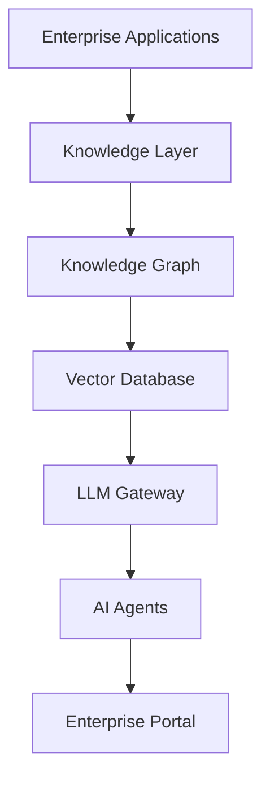

<p align="center">

</p>

# 🧠 Enterprise Digital Brain
<p align="center">


</p>

> [!NOTE]
> **Project Status**
>
> Enterprise Digital Brain is currently in the **Architecture & Design** phase.
>
> We are actively developing the platform and welcome ideas, discussions, and community contributions.

## 📑 Table of Contents

- [Overview](#-overview)
- [Vision](#-vision)
- [Features](#-features)
- [Architecture](#-architecture)
- [Getting Started](#-getting-started)
- [Project Structure](#-project-structure)
- [Documentation](#-documentation)
- [Roadmap](#-roadmap)
- [Contributing](#-contributing)
- [License](#-license)
  
---

## 🚀 Overview

Enterprise Digital Brain is an open-source framework for building intelligent enterprise knowledge platforms powered by Artificial Intelligence, Large Language Models, Agentic AI, Retrieval-Augmented Generation (RAG), and Knowledge Graphs.

The goal is to enable organizations to transform enterprise knowledge into an intelligent decision-support system.

---

# ✨ Features

- 🧠 Enterprise Knowledge Management
- 🤖 AI Agent Framework
- 🔍 Enterprise Search
- 📚 Knowledge Graph Integration
- ⚡ Retrieval-Augmented Generation (RAG)
- ☁️ Cloud-Native Architecture
- 📊 Decision Intelligence
- 🔒 Governance & Security
- 📈 Analytics & Monitoring
- 🔗 Enterprise System Integration
  
## 🎯 Vision

Create an AI-powered digital brain capable of:

- Enterprise Search
- Intelligent Knowledge Discovery
- AI Assistants
- Agentic Workflows
- Decision Intelligence
- Enterprise Memory
- Knowledge Graphs
- AI Governance


```
## 🏗 Architecture



---

# 🚀 Getting Started

Clone the repository.

```bash
git clone https://github.com/Enterprise-Intelligence-Lab/enterprise-digital-brain.git
```

Navigate into the project.

```bash
cd enterprise-digital-brain
```

# 📂 Project Structure

```
enterprise-digital-brain
│
├── assets
├── docs
├── architecture
├── examples
├── src
├── README.md
├── LICENSE
├── CONTRIBUTING.md
├── SECURITY.md
└── CHANGELOG.md
```

Project documentation is under active development.

# 🗺 Roadmap

## Version 1.0

- [ ] Knowledge Graph
- [ ] Enterprise Search
- [ ] Vector Database
- [ ] RAG Pipeline
- [ ] AI Agent Framework

## Version 2.0

- [ ] Multi-Agent Collaboration
- [ ] Kubernetes Deployment
- [ ] Enterprise Memory
- [ ] Cloud Integration
- [ ] Governance Dashboard

## Future

- [ ] Digital Twin Integration
- [ ] MCP Support
- [ ] Multi-LLM Support

---

# 🛠 Technology Stack

| Layer | Technologies |
|--------|--------------|
| AI | OpenAI, Azure AI, Anthropic |
| LLMOps | LangChain, LangGraph |
| Search | RAG, Vector Database |
| Cloud | AWS, Azure |
| DevOps | Docker, Kubernetes |
| Data | Knowledge Graphs |

# 📚 Documentation

| Guide | Status |
|--------|--------|
| Architecture | 🚧 In Progress |
| Installation | 🚧 In Progress |
| Quick Start | 🚧 In Progress |
| API Reference | 🚧 In Progress |
| Examples | 🚧 In Progress |
| Roadmap | ✅ Available |

---
# 📸 Screenshots

Coming Soon

# 🌍 Community

⭐ Star this repository

🐛 Report Issues

💡 Share Ideas

🤝 Submit Pull Requests

---

# 📜 License

MIT License

---

<p align="center">

Built with ❤️ by Enterprise Intelligence Lab

🌐 https://www.enterpriseintelligencelab.com

</p>
